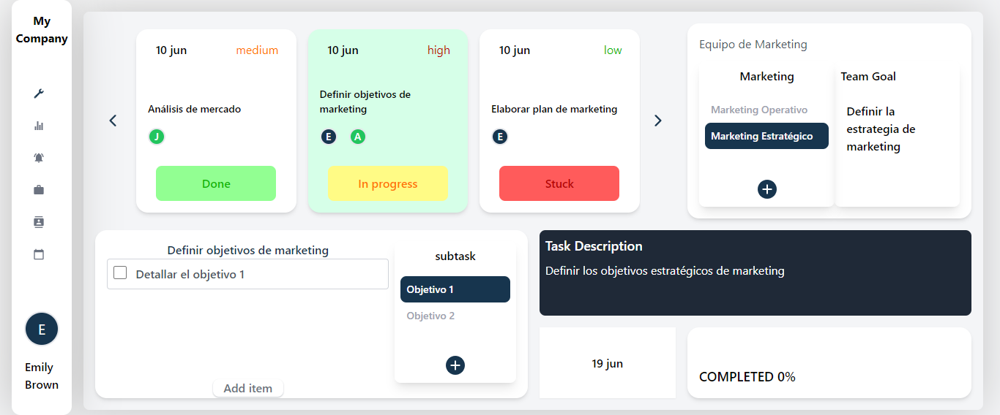
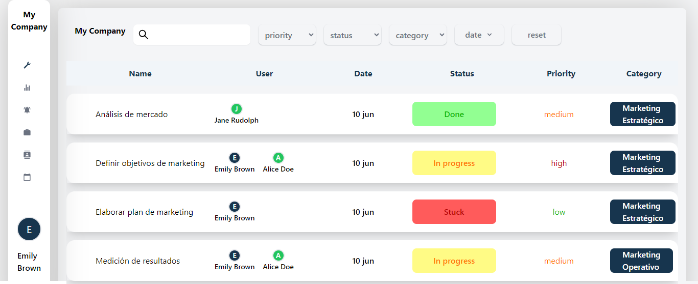

# monorepo-next13-Redux-RTK
<h1>T-Task</h1>

<h2><a id="user-content-tabla-de-contenido" class="anchor" aria-hidden="true" href="#tabla-de-contenido"><svg class="octicon octicon-link" viewBox="0 0 16 16" version="1.1" width="16" height="16" aria-hidden="true"><path fill-rule="evenodd" d="M7.775 3.275a.75.75 0 001.06 1.06l1.25-1.25a2 2 0 112.83 2.83l-2.5 2.5a2 2 0 01-2.83 0 .75.75 0 00-1.06 1.06 3.5 3.5 0 004.95 0l2.5-2.5a3.5 3.5 0 00-4.95-4.95l-1.25 1.25zm-4.69 9.64a2 2 0 010-2.83l2.5-2.5a2 2 0 012.83 0 .75.75 0 001.06-1.06 3.5 3.5 0 00-4.95 0l-2.5 2.5a3.5 3.5 0 004.95 4.95l1.25-1.25a.75.75 0 00-1.06-1.06l-1.25 1.25a2 2 0 01-2.83 0z"></path></svg></a>Tabla de contenido
</h2>
<ul>
  <li><a href="#introduccion-al-proyecto">Introducción al proyecto</a></li>
  <li><a href="#implementaci%C3%B3n-del-proyecto">Implementacion del proyecto</a></li>
  <li><a href="#iniciar-aplicacion">Iniciar application</a></li>
</ul>

<h2><a id="user-content-introduccion-al-proyecto" class="anchor" aria-hidden="true" href="#introduccion-al-proyecto"><svg class="octicon octicon-link" viewBox="0 0 16 16" version="1.1" width="16" height="16" aria-hidden="true"><path fill-rule="evenodd" d="M7.775 3.275a.75.75 0 001.06 1.06l1.25-1.25a2 2 0 112.83 2.83l-2.5 2.5a2 2 0 01-2.83 0 .75.75 0 00-1.06 1.06 3.5 3.5 0 004.95 0l2.5-2.5a3.5 3.5 0 00-4.95-4.95l-1.25 1.25zm-4.69 9.64a2 2 0 010-2.83l2.5-2.5a2 2 0 012.83 0 .75.75 0 001.06-1.06 3.5 3.5 0 00-4.95 0l-2.5 2.5a3.5 3.5 0 004.95 4.95l1.25-1.25a.75.75 0 00-1.06-1.06l-1.25 1.25a2 2 0 01-2.83 0z"></path></svg></a>Introduccion al proyecto</h2>

App de administración de tareas colaborativa, desarrollada con Next.js, TypeScript y Lerna, ayuda a los equipos empresariales a gestionar y realizar un seguimiento eficiente de sus tareas diarias. Cada equipo puede crear categorías específicas para organizar las tareas relacionadas con sus áreas, lo que facilita la estructura y organización del trabajo.

Los usuarios pueden asignar tareas a sí mismos o a otros miembros del equipo, y las tareas se pueden desglosar en subtareas para un enfoque más detallado. Esto fomenta la colaboración y el seguimiento individual y del equipo. Next.js proporciona un rendimiento y renderización eficientes, mientras que TypeScript brinda seguridad adicional durante el desarrollo. Lerna se encarga de la gestión de dependencias.

<h2><a id="user-content-implementación-del-proyecto" class="anchor" aria-hidden="true" href="#implementación-del-proyecto"><svg class="octicon octicon-link" viewBox="0 0 16 16" version="1.1" width="16" height="16" aria-hidden="true"><path fill-rule="evenodd" d="M7.775 3.275a.75.75 0 001.06 1.06l1.25-1.25a2 2 0 112.83 2.83l-2.5 2.5a2 2 0 01-2.83 0 .75.75 0 00-1.06 1.06 3.5 3.5 0 004.95 0l2.5-2.5a3.5 3.5 0 00-4.95-4.95l-1.25 1.25zm-4.69 9.64a2 2 0 010-2.83l2.5-2.5a2 2 0 012.83 0 .75.75 0 001.06-1.06 3.5 3.5 0 00-4.95 0l-2.5 2.5a3.5 3.5 0 004.95 4.95l1.25-1.25a.75.75 0 00-1.06-1.06l-1.25 1.25a2 2 0 01-2.83 0z"></path></svg></a>Implementación del proyecto</h2>
<ul>
<li><strong>TypeScript</strong>: Superset de JavaScript que implementa tipado estricto.</li>
<li><strong>Next 13</strong>: Framework utilizado para el desarrollo del proyecto</li>
<li><strong>Lerna</strong>: administrador de monorepo</li>
  <li><strong>Redux</strong>: administrador de estados</li>
</ul>

El proyecto está construido utilizando Lerna para dividir el núcleo de la aplicación y permitir un escalado eficiente en el futuro. Para asegurar la reutilización de componentes en otros proyectos, se desarrollaron componentes en un enfoque basado en hooks, lo que garantiza un código más limpio y legible en general.
<h2><a id="user-content-iniciar-aplicacion" class="anchor" aria-hidden="true" href="#iniciar-aplicacion"><svg class="octicon octicon-link" viewBox="0 0 16 16" version="1.1" width="16" height="16" aria-hidden="true"><path fill-rule="evenodd" d="M7.775 3.275a.75.75 0 001.06 1.06l1.25-1.25a2 2 0 112.83 2.83l-2.5 2.5a2 2 0 01-2.83 0 .75.75 0 00-1.06 1.06 3.5 3.5 0 004.95 0l2.5-2.5a3.5 3.5 0 00-4.95-4.95l-1.25 1.25zm-4.69 9.64a2 2 0 010-2.83l2.5-2.5a2 2 0 012.83 0 .75.75 0 001.06-1.06 3.5 3.5 0 00-4.95 0l-2.5 2.5a3.5 3.5 0 004.95 4.95l1.25-1.25a.75.75 0 00-1.06-1.06l-1.25 1.25a2 2 0 01-2.83 0z"></path></svg></a>Iniciar aplicacion</h2>

Necesitaras esta dependencia para correr el proyecto:

<ul>
    <li><a href="https://nodejs.org/es" rel="nofollow">Node</a>.</li>
</ul>

 

<h2>Features</h2>
<ul>
  <li>
Personal task manager
</li>
  <li>
Table task filter
</li>
</ul>

 

Instalar librerias:

<pre><code>yarn install
</code></pre>

Crear build:

<pre><code>yarn build
</code></pre>

Correr la aplicacion:

<pre><code>yarn dev
</code></pre>
